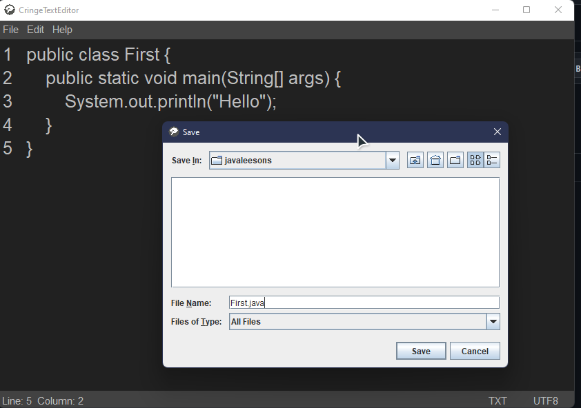

# CringeTextEditor
---

Simple text editor on Java
  
  Commands:
  
    New: Ctrl+N
    Open File: Ctrl + O
    Save: Ctrl + S
    Save As: Ctrl + L
    Themes: Ctrl + K
    Exit: Ctrl + T
    
    Undo: Ctrl + Z
    Redo: Ctrl + Y
    Cut: Ctrl + X
    Copy: Ctrl + C
    Paste: Ctrl + V
    Find: Ctrl + F
    Replace: Ctrl + R
    Find + Replace: Ctrl + F + Ctrl + R
    Timestamp: Ctrl + E

* Edit Menu:

* File Menu:

* Save:

* Text Edit:

* Version:

* Find:

* Find and Replace:

Future ideas:

 * Add syntax highlighter
---

